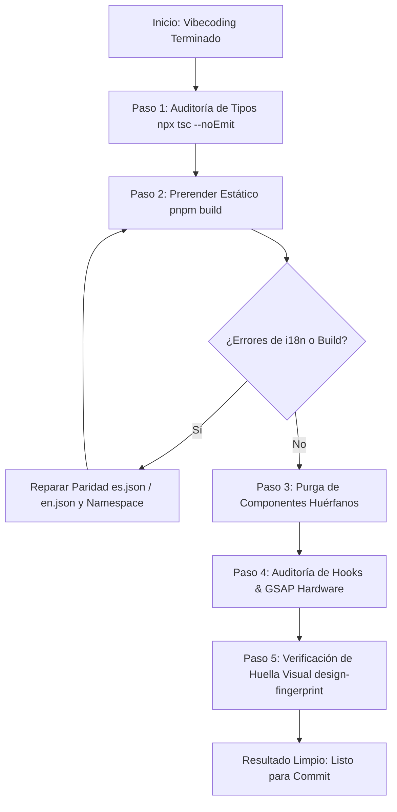

# 🧹 Build & Clean Protocol (Hardening & Purga)

> **Qué es:** El protocolo maestro de estabilización, compilación y limpieza arquitectónica para ejecutar durante o al finalizar cualquier sesión de desarrollo rápido de UI.
> **Cuándo usarlo:** Invícalo cada vez que termines de crear o modificar componentes, cuando el compilador o el navegador lancen errores de hidratación/i18n, o antes de enviar cambios a producción (`git commit`).
> **Objetivo:** Permitirte iterar a máxima velocidad creativa sin acumular deuda técnica, componentes huérfanos, errores silenciosos de `next-intl` o fugas de rendimiento en GSAP/React 19.

---

## 0 · Las 5 Leyes del Hardening en Epicare

1. **Cero Tolerancia a `MISSING_MESSAGE`:** Todo texto renderizado debe existir de forma idéntica y con paridad de claves en `messages/es.json` y `messages/en.json`.
2. **Pureza de Render (React 19 / Next.js 16):** Cero llamadas impuras en el render (`Math.random()`, accesos directos a `window`/`document` fuera de `useEffect`/`useLayoutEffect`).
3. **Purga Inmediata de Código Muerto:** Cualquier variante de prueba (ej. `SectionVariantA.tsx`, `HeroTest.tsx`) que no esté importada activamente en una ruta de `src/app/` debe eliminarse de inmediato.
4. **Disciplina Hardware Symphony (GSAP & Lenis):** Todo trigger o animación debe vivir dentro de un `gsap.context` con `ctx.revert()` en el cleanup. Scroll programático siempre por `window.lenis.scrollTo`.
5. **Zero Arbitrary Values (Zero-Px Policy):** Todo color, tipografía y espaciado debe provenir de los tokens de `globals.css` y `lib/motion.ts`. Los ``/`<video>` deben resolverse mediante `asset()` de `@/lib/asset`.

---

## 1 · Pipeline de Ejecución Paso a Paso

Cualquier agente o desarrollador que ejecute este protocolo debe seguir esta secuencia estricta:



---

### Paso 1 · Chequeo Rápido de Tipos (TypeScript)
Identifica fallos de interfaces, tipos incompatibles o props no existentes introducidas durante el vibecoding.

```bash
cd design-system-app
npx tsc --noEmit
```

---

### Paso 2 · Prerender Estático & Captura de i18n (`pnpm build`)
Como el proyecto compila con `output: "export"`, `pnpm build` ejecuta Turbopack y prerenderiza **todas las rutas estáticas (13/13)**. Esto expone inmediatamente:
* Claves faltantes de `next-intl` (`MISSING_MESSAGE: <namespace>.<key>`).
* Discrepancias entre `es.json` y `en.json` (ej. arrays de longitud distinta o nombres de propiedades desfasados como `titleLine1` vs `title1`).
* Errores de acceso a APIs de navegador en SSR.

```bash
cd design-system-app
pnpm build
```

#### Regla de Reparación i18n:
* Si el componente usa `const t = useTranslations("landingV2.miSeccion")`, verifica que en **ambos** archivos `messages/es.json` y `messages/en.json` el objeto `landingV2.miSeccion` contenga exactamente las mismas llaves con los mismos tipos.
* Español: **Tú neutro, jamás voseo** (`trabajas`, `operas`, `tú`).
* Asegúrate de que `alt=""` y `aria-label` usen también strings del diccionario.

---

### Paso 3 · Detección y Purga de Código Muerto (Dead Code)
Durante el vibecoding es común crear archivos auxiliares (`ComponenteA.tsx`, `ComponenteB.tsx`, `SectionOscilloscope.tsx`). 

1. **Revisar rutas activas:** `src/app/page.tsx`, `src/app/go-ams/page.tsx`, `src/app/licensing/page.tsx`.
2. **Identificar huérfanos:** Busca archivos en `src/components/` que no tengan ningún `import` activo en la aplicación.
3. **Eliminar sin piedad:** Elimina los archivos huérfanos para evitar errores de linting, imports fantasma y sobrecarga en el repositorio.

---

### Paso 4 · Auditoría de Calidad Hardware & React 19
Revisa los componentes creados o tocados contra los bugs más comunes:

| Patrón Prohibido | Causa del Bug | Solución Obligatoria |
|:---|:---|:---|
| `Math.random()` en el cuerpo del componente | Rompe la pureza de render en React 19 (`react-hooks/purity`) | Usar fórmulas matemáticas deterministas (ej. senos/cosenos basados en index) o memoizar con `useMemo`. |
| `gsap.to()` fuera de `gsap.context` | Crea animaciones y ScrollTriggers huérfanos en re-renders | Envolver siempre en `useLayoutEffect` con `const ctx = gsap.context(() => {}, containerRef)` y `return () => ctx.revert()`. |
| `ScrollTrigger` con alturas variables (acordeones/tabs) | Los pins y triggers se desfasan al cambiar la altura del DOM | Invocar `ScrollTrigger.refresh()` tras animar la apertura/cierre de acordeones o al montar imágenes/vídeos. |
| `window.scrollTo` o `scrollIntoView` | Provoca saltos bruscos y combate contra el motor de Lenis | Usar `window.lenis?.scrollTo(target, { offset: ... })`. |
| `src="/Files/..."` sin helper | Rompe las rutas en GitHub Pages debido al `basePath: '/Epicare'` | Usar siempre `src={asset('/Files/...')}` importado de `@/lib/asset`. |

---

### Paso 5 · Verificación Anti-Regresión Visual (Design Fingerprint)
Ejecuta la herramienta de huella digital para certificar que no se movieron clases ni estructuras de secciones no autorizadas:

```bash
cd design-system-app
node scripts/design-fingerprint.mjs scripts/baseline/landing.baseline.html out/index.html
```

* Si las diferencias corresponden **únicamente a la sección nueva o modificada con autorización**, el resultado es correcto.
* Si el cambio fue un refactor o limpieza pura, el total debe ser `TOTAL: 0`.

---

## 2 · PROMPT PARA INVOCAR EL PROTOCOLO

Copia y pega este prompt cuando quieras que la IA ejecute este protocolo de saneamiento completo:

```markdown
Por favor ejecuta el @Graph-Design-Framework/command-prompts/build-clean-protocol.md en design-system-app:

1. Ejecuta `npx tsc --noEmit` y repara cualquier error de tipos.
2. Ejecuta `pnpm build` para validar el prerenderizado estático y asegurar que NO haya advertencias de i18n (`MISSING_MESSAGE`) ni errores de traducción entre es.json y en.json.
3. Detecta y purga cualquier componente o archivo huérfano en `src/components/` que no esté siendo importado por las rutas activas.
4. Audita que los componentes tocados respeten las reglas de React 19 (purity), GSAP (`gsap.context` con `revert()`), Lenis y el uso de `asset()`.
5. Corre `node scripts/design-fingerprint.mjs scripts/baseline/landing.baseline.html out/index.html` y resume los cambios exactos.

Al terminar, entrégame el reporte detallando: qué se corrigió, qué archivos huérfanos se eliminaron y el estado final del build.
```
